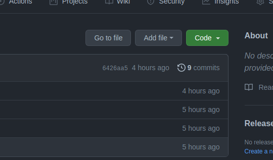

# SicoobNET Empresarial
## Script para instalação

:rotating_light: **Antes de descrever o que o `script` faz, gostaria de pedir que, se o `script` ajudar de alguma forma de um Feedback na aba de _discussão (Discussion)_. Obrigado!** :rotating_light:

### Informações Importantes
Antes de mais nada, gostaria de informar que este script foi feito por mim para auxiliar um amigo que não possui domínio nenhum de GNU/Linux. Então o fiz de maneira bem simplória.

Básicamente o que o Script irá fazer é acessar o link de Download no site official do [SicoobNET Empresarial]("https://empresarial.sicoobnet.com.br/instalador/") e fazer o download para a sua maquina.

## Inciando Instalação
### Adquirindo o script
Via **git clone**
> cd $HOME && git clone https://github.com/devalvez/sicoobnetEmpresarial-autoInstall.git

Via **zip** 
> Baixe o arquivo `*.zip`

> Extraia para o diretório $HOME

Se a opção de download escolhida for via **.zip**, depois de extrair a pasta renomeie a pasta de `sicoobnetEmpresarial-autoInstall-main` para `sicoobnetEmpresarial-autoInstall`

Em seguida abra um terminal:

>`Ctrl + Alt +t`

ou acesse pelo menu de programas.

Com o terminal aberto, execute o seguinte comando para acessar a pasta com os arquivos.

> `cd sicoobnetEmpresarial-autoInstall`

Uma vez dentro do diretório, execute o camando, que dará ao script a permição para execução:

> sudo chmod +x install.sh run.sh

### Dependências

* Java 8
* IcedTea-Web

Em seguida vamos executar o `install.sh` da seguinte maneira:
> ./install.sh

Se todas as dependências estiverem devidamente instaladas, a instalação começará automaticamente. Caso não estajam instaladas e não intalarem automaticamente através do `script` irá retornar um erro. Procure instala-las manualmente, seguido o passo a passo de acordo com a sua distribuição.

Uma vez que as depedências estiverem instaladas e se tudo correr bem, aparecerá o splash screen do IcedTea e então é só seguir as etapas.

Concluída a instalação o programa **SicoobNET Empresarial** será iniciado, após concluida a inicialização, antes de inserir as credenciais de acesso feche o programa. Assim que encerrar a aplicação será criado o atalho na área de trabalho.

### Atalho na área de trabalho
Em alguns ambites como no ***Cinnamon*** onde foi testado o script o atalho não funcionou. Mas a solução foi é bem simples.

basta acessar a pasta onde foi instalado o programa SicoobNET via terminal e executar manualmente. Caso não tenha alterado os diretórios do script, basta seguir os passos a baixo.

> `Ctrl + Alt + t`  
> `cd $HOME/sicoobnetEmpresarial-autoInstall/Sicoobnet && ./run.sh`

Se o atalho gerado na área de trabalho não funcionar basta executar manualmente.
> cd $HOME/.config/Sicoobnet && java -jar office.jar

:rotating_light: Lembrando! Não esqueça de deixar os seu _Feedback_ na aba de _dicussão (discussion)_ se te ajudou de alguma maneira :rotating_light:
